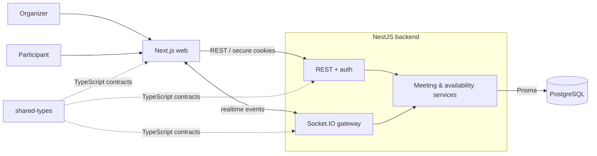

<div align="center">
  

  # Synk

  **Find time. Together.**

  A lightweight meeting planner for collecting availability, seeing overlap live, and choosing the best time without requiring participant accounts.

  
  
  
  
</div>

## What Synk does

1. An organizer creates a date range, working hours, and meeting duration.
2. Synk creates a private invitation link.
3. Participants enter a display name and mark the 15-minute slots that work for them.
4. Availability updates into a shared heatmap and ranked best-time suggestions.
5. The organizer confirms the final meeting time.

Participants do not need accounts. A participant can reuse the same name on another device to reopen their saved response, while organizer accounts keep meeting creation and management private.

## Highlights

- Unified editable availability heatmap with optimistic updates.
- Realtime changes through Socket.IO.
- Best-time suggestions across the full requested meeting duration.
- Mobile one-day navigation and touch-friendly editing/inspection.
- Organizer locking, reopening, editing, participant removal, and finalization.
- Dark/light themes, RTL support, PWA support, and 12 interface languages.
- Autosave with throttling, retry backoff, and per-device participant sessions.

## Architecture



`shared-types` is a compile-time contract package; it is not a separate runtime service.

## Stack

| Area | Technology |
| --- | --- |
| Web | Next.js 16, React 19, TypeScript, Tailwind CSS |
| Client data | TanStack Query, Socket.IO client |
| API | NestJS 11, REST, Socket.IO |
| Database | PostgreSQL 16+, Prisma |
| Workspace | pnpm monorepo + shared TypeScript contracts |

## Run locally

Requirements: **Node.js 22**, **pnpm 10.15**, and **PostgreSQL 16+**.

On Windows, the shortest path is:

```powershell
corepack enable
pnpm install
Copy-Item apps\api\.env.example apps\api\.env
pnpm synk
```

Synk starts the web app at `http://localhost:3000` and the API at `http://localhost:4000`.

For a manual start:

```powershell
pnpm install
pnpm prisma:generate
pnpm prisma:migrate
pnpm dev:api
```

Then, in another terminal:

```powershell
pnpm dev:web
```

## Repository

```text
apps/web/             Next.js frontend and PWA
apps/api/             NestJS API, Prisma schema, migrations, realtime gateway
packages/shared-types Shared contracts used by web and API
scripts/              Local launcher, load tests, and security checks
```

## Useful commands

| Command | Purpose |
| --- | --- |
| `pnpm synk` | Prepare and launch the local stack on Windows |
| `pnpm build` | Build web and API |
| `pnpm lint` | Lint web and API |
| `pnpm performance:load` | Run the meeting load scenario |
| `pnpm security:audit` | Run the security audit script |

## Security notes

- Organizer sessions use short-lived access tokens and rotating refresh tokens in HTTP-only cookies.
- Mutating requests use signed CSRF protection and explicit CORS origins.
- Participant sessions are scoped to a meeting invitation and device session.

---

Synk is built around one simple flow: **share a link, collect availability, choose a time.**
